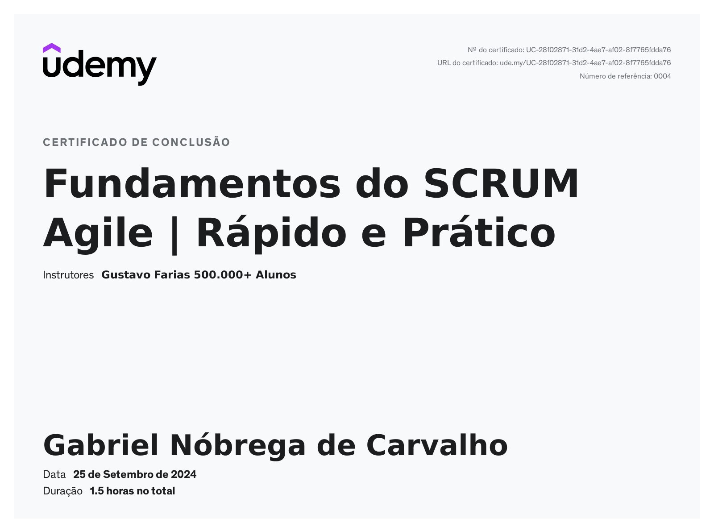

# 📚 RESUMO DIA 2 - Planning Sprint 1

Este documento contém um resumo dos principais conceitos e práticas do **SCRUM Agile**, uma metodologia ágil amplamente utilizada em gestão de projetos.

## 📑 Índice

- [O que é SCRUM?](#o-que-é-scrum)
- [Papéis no SCRUM](#papéis-no-scrum)
  - [Product Owner](#1-product-owner)
  - [Scrum Master](#2-scrum-master)
  - [Equipe de Desenvolvimento](#3-equipe-de-desenvolvimento)
- [Artefatos do SCRUM](#artefatos-do-scrum)
  - [Product Backlog](#1-product-backlog)
  - [Sprint Backlog](#2-sprint-backlog)
  - [Incremento](#3-incremento)
- [Eventos do SCRUM](#eventos-do-scrum)
  - [Sprint](#1-sprint)
  - [Planejamento do Sprint](#2-planejamento-do-sprint-sprint-planning)
  - [Daily Scrum](#3-daily-scrum-scrum-diário)
  - [Revisão do Sprint](#4-revisão-do-sprint-sprint-review)
  - [Retrospectiva do Sprint](#5-retrospectiva-do-sprint-sprint-retrospective)
- [Ciclo de Vida do SCRUM](#ciclo-de-vida-do-scrum)
- [Benefícios do SCRUM](#benefícios-do-scrum)
- [Certificados](#certificados)

---

## O que é SCRUM?

SCRUM é uma metodologia ágil para gerenciar e controlar projetos, especialmente em desenvolvimento de software. Ele se baseia em ciclos curtos de trabalho chamados *sprints* e promove uma abordagem iterativa e incremental.

### Principais Conceitos:
- **Iterativo e Incremental**: O trabalho é dividido em pequenos ciclos (sprints) com entregas frequentes.
- **Transparência e Inspeção**: Processos e progresso são visíveis e ajustáveis.
- **Adaptação**: Respostas rápidas a mudanças e feedback contínuo.

---

## Papéis no SCRUM

### 1. Product Owner
- **Responsável** pela definição do que será feito no projeto.
- **Prioriza** o backlog do produto (lista de tarefas e requisitos).
- **Representa** os interesses dos stakeholders e usuários.

### 2. Scrum Master
- **Facilitador** que garante que o SCRUM seja seguido corretamente.
- **Remove impedimentos** que possam atrapalhar o progresso da equipe.
- **Ajuda a equipe** a melhorar processos e práticas.

### 3. Equipe de Desenvolvimento
- **Responsável** pela execução das tarefas e entrega de incrementos do produto.
- **Autogerida e Multifuncional**: A equipe possui todas as habilidades necessárias para entregar o produto.

---

## Artefatos do SCRUM

### 1. Product Backlog
- **Lista priorizada** de todos os itens e requisitos do produto.
- **Gerido pelo Product Owner**.

### 2. Sprint Backlog
- **Lista de tarefas** selecionadas do Product Backlog para um sprint específico.
- **Gerido pela equipe** durante o sprint.

### 3. Incremento
- **Resultado** do trabalho realizado durante um sprint.
- **Deve estar pronto** para ser entregue ou lançado.

---

## Eventos do SCRUM

### 1. Sprint
- **Ciclo de trabalho** com duração fixa (geralmente 2 a 4 semanas).
- **Objetivo**: Entregar um incremento funcional do produto.
- **Planejamento e Avaliação**: Cada sprint começa com o Planejamento do Sprint e termina com a Revisão e Retrospectiva.

### 2. Planejamento do Sprint (Sprint Planning)
- **Reunião** no início de cada sprint para definir o que será feito.
- **Discussão** sobre o que pode ser entregue e como será feito.
- **Divisão de Tarefas**: Detalhamento do Sprint Backlog e definição das tarefas.

### 3. Daily Scrum (Scrum Diário)
- **Reunião diária** de 15 minutos para alinhar a equipe.
- **Perguntas**: O que foi feito ontem? O que será feito hoje? Há impedimentos?
- **Objetivo**: Atualizar o progresso e identificar obstáculos.

### 4. Revisão do Sprint (Sprint Review)
- **Reunião ao final do sprint** para revisar o trabalho feito e adaptar o Product Backlog.
- **Demonstração** do incremento para stakeholders.
- **Feedback**: Obter feedback e ajustar prioridades para o próximo sprint.

### 5. Retrospectiva do Sprint (Sprint Retrospective)
- **Reunião após a revisão** para refletir sobre o sprint.
- **Identificação** de melhorias para o próximo sprint.
- **Ações**: Criar um plano para melhorar o processo e a colaboração.

---

## Ciclo de Vida do SCRUM

1. **Planejamento**: Definir o backlog do produto e preparar o backlog do sprint.
2. **Execução**: Desenvolver o trabalho durante o sprint.
3. **Revisão**: Revisar o trabalho feito e adaptar o backlog.
4. **Reflexão**: Refletir sobre o processo e implementar melhorias.

---

## Benefícios do SCRUM

- **Flexibilidade**: Adapta-se a mudanças e feedback contínuo.
- **Transparência**: Visibilidade clara do progresso e desafios.
- **Eficiência**: Entregas rápidas e iterativas.
- **Colaboração**: Melhora a comunicação e colaboração entre os membros da equipe.

O SCRUM é eficaz para projetos onde requisitos podem evoluir e mudanças são frequentes, oferecendo uma estrutura para gerenciar complexidade e melhorar a produtividade da equipe.

---

## Certificados

---