# 📚 RESUMO DIA 7 - SQL

[](./dia7.md)

---

## 📑 Índice

1. [Introdução ao PostgreSQL](#postgresql)
2. [Códigos Básicos em SQL](#códigos-básicos-em-sql)
3. [Exercício Prático: Exercitando SQL](#exercício-prático-exercitando-sql)

---

## PostgreSQL

- **Modelo de dados:** Relacional, baseado em tabelas com linhas e colunas, semelhante a uma planilha.
- **Linguagem de consulta:** SQL (**Structured Query Language**), uma linguagem padronizada e poderosa para interagir com os dados.
- **Recursos:** Propriedades **ACID** (Atomicidade, Consistência, Isolamento, Durabilidade), garantindo a integridade dos dados em caso de falhas. Suporta transações, triggers, stored procedures e funções, oferecendo grande flexibilidade.
- **Ideal para:** Aplicações que exigem integridade de dados, transações complexas e conformidade com ACID, como sistemas financeiros, de gerenciamento de estoque e e-commerce.

---

## Códigos Básicos em SQL

Aqui estão alguns exemplos básicos de comandos SQL para o **PostgreSQL**:

```sql
-- Criar uma tabela de produtos
CREATE TABLE produtos (
    id SERIAL PRIMARY KEY,
    nome VARCHAR(255),
    descricao TEXT,
    preco DECIMAL(10, 2)
);

-- Adicionar um produto
INSERT INTO produtos (nome, descricao, preco) 
VALUES ('Camiseta', 'Camiseta de algodão', 29.90);

-- Pesquisar um produto por nome
SELECT * FROM produtos WHERE nome = 'Camiseta';

-- Pesquisar produtos com preço maior que 50
SELECT * FROM produtos WHERE preco > 50;

-- Remover um produto por ID
DELETE FROM produtos WHERE id = 1;
```

---

## Exercício Prático: Exercitando SQL

Neste exercício de SQL, utilizamos o site [sqliteonline.com](https://sqliteonline.com/) como compilador para executar **Querys SQL**. As etapas para configurar o banco de dados foram as seguintes:

1. Acessar o site [sqliteonline.com](https://sqliteonline.com/) e conectar ao banco PostgreSQL;
2. Importar o arquivo [`database_challenge.sql`](../Exercícios/SQL/database_challenge.sql) via opção **Open SQL**;
3. Executar o script para criar as tabelas necessárias.

Com o banco de dados configurado, foram realizadas querys para consultas e manipulações nas tabelas de **Usuários** e **Produtos**, abordando operações como contagem de registros, filtragem por atributos específicos, exclusão de registros e consultas com condições de intervalo.

---

### Querys a serem realizadas:

#### 1. Tabela de Usuários
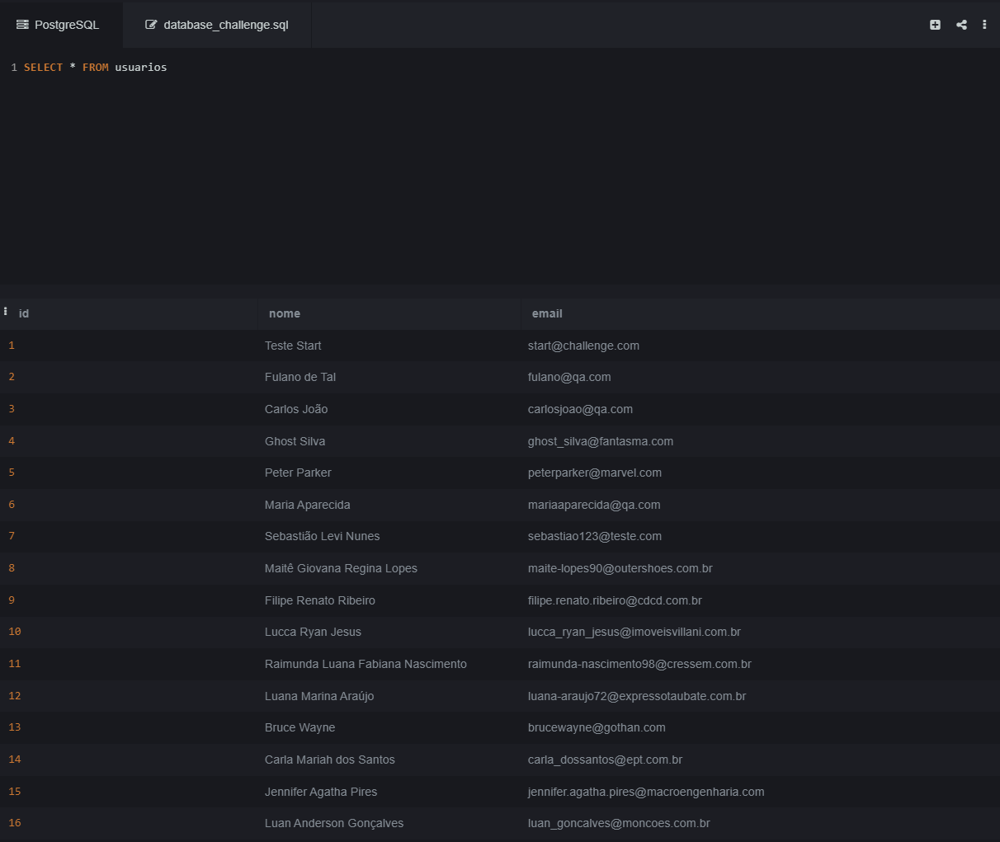
Baseando-se na tabela de **Usuários**, execute as seguintes Querys:

1. **Realizar uma consulta que conte o número de registros na tabela:**

   ```sql
   SELECT COUNT(*) FROM usuarios;
   ```
   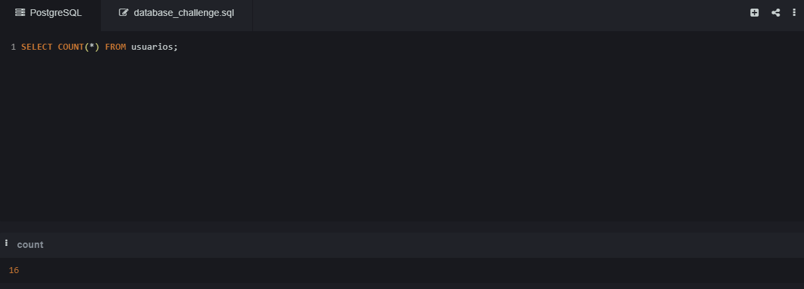
  

2. **Realizar uma consulta para encontrar o usuário com o id 10:**

   ```sql
   SELECT * FROM usuarios WHERE id = 10;
   ```
   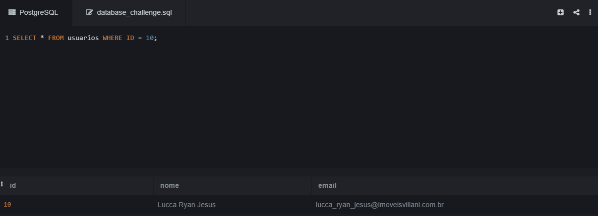

3. **Realizar uma consulta para encontrar o usuário com o nome "Bruce Wayne":**

   ```sql
   SELECT * FROM usuarios WHERE nome = 'Bruce Wayne';
   ```
   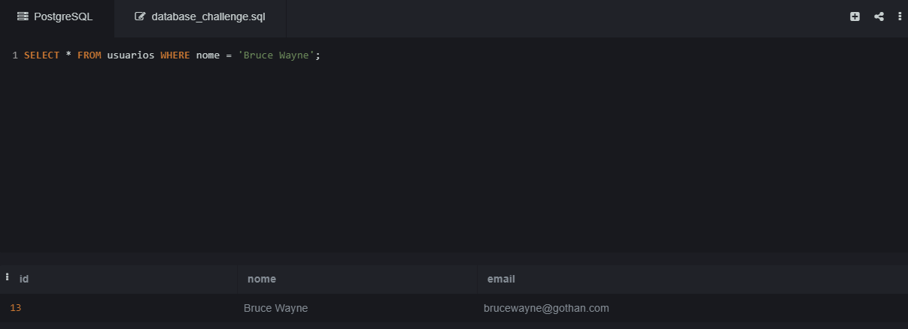

4. **Realizar uma consulta para encontrar o usuário com o e-mail "ghost_silva@fantasma.com":**

   ```sql
   SELECT * FROM usuarios WHERE email = 'ghost_silva@fantasma.com';
   ```
   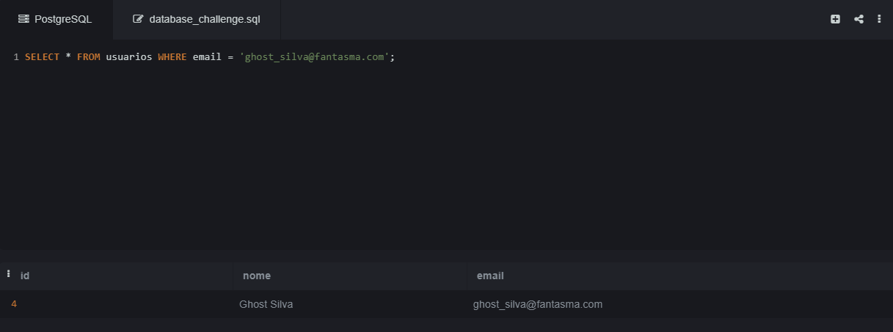

5. **Realizar uma consulta para deletar o usuário com e-mail "peterparker@marvel.com":**

   ```sql
   DELETE FROM usuarios WHERE email = 'peterparker@marvel.com';
   ```
   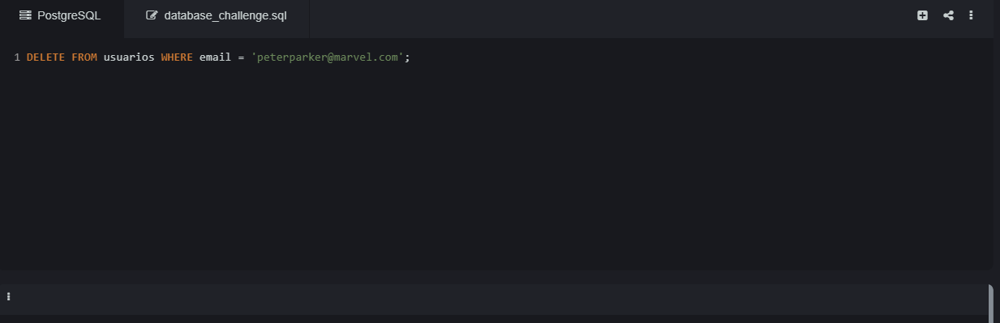
   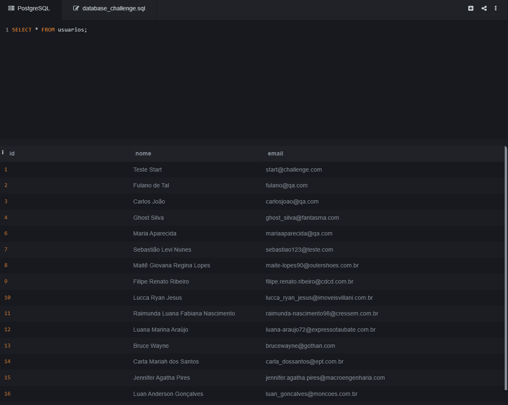

---

#### 2. Tabela de Produtos
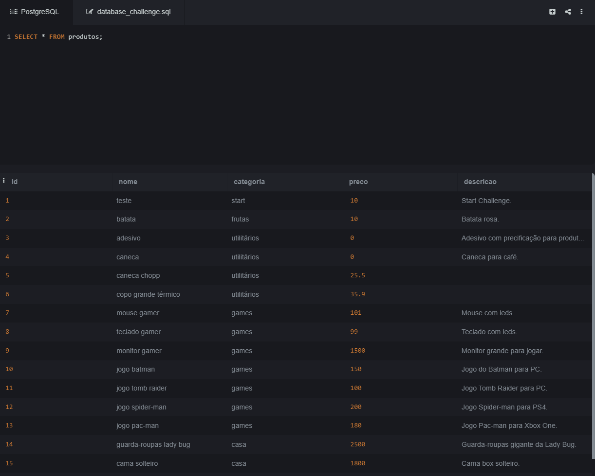
Baseando-se na tabela de **Produtos**, execute as seguintes Querys:

1. **Realizar uma consulta que apresente produtos com descrição vazia:**

   ```sql
   SELECT * FROM produtos WHERE descricao = '';
   ```
   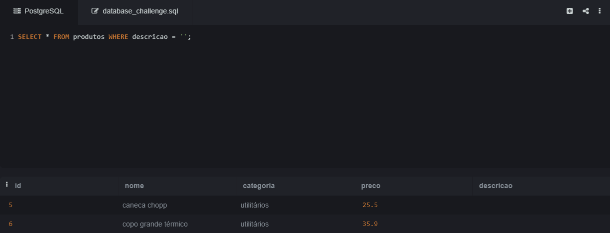

2. **Realizar uma consulta que apresente produtos com a categoria "games":**

   ```sql
   SELECT * FROM produtos WHERE categoria = 'games';
   ```
   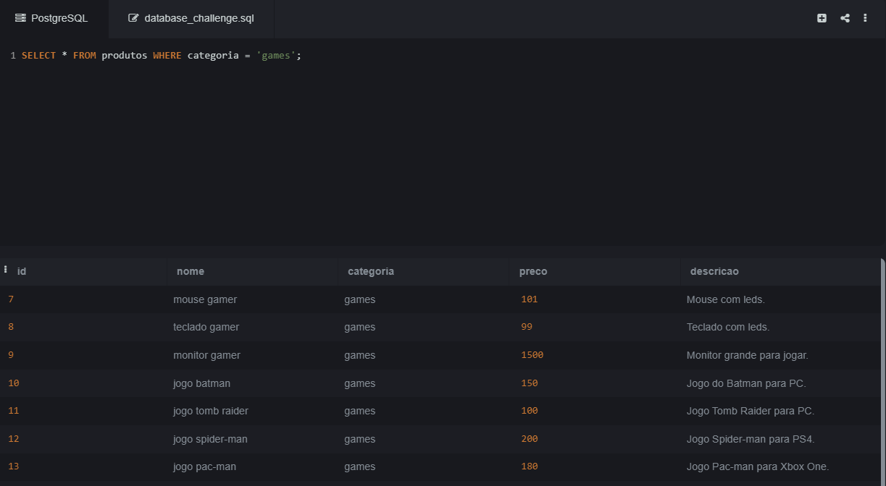

3. **Realizar uma consulta que apresente produtos com preço "0":**

   ```sql
   SELECT * FROM produtos WHERE preco = 0;
   ```
   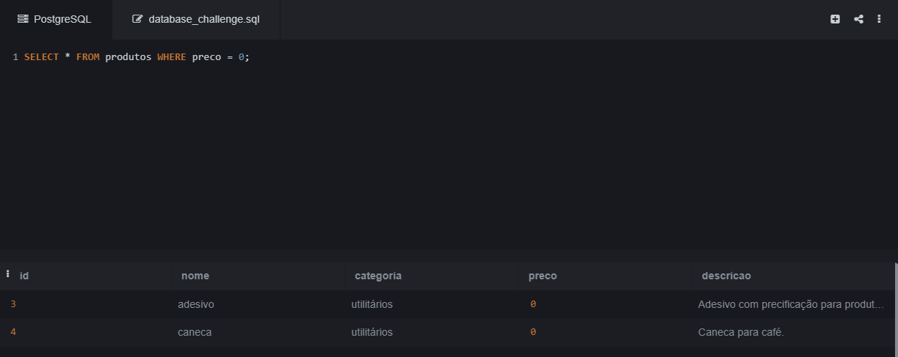

4. **Realizar uma consulta que apresente produtos com o preço maior que "100.00":**

   ```sql
   SELECT * FROM produtos WHERE preco > 100.00;
   ```
   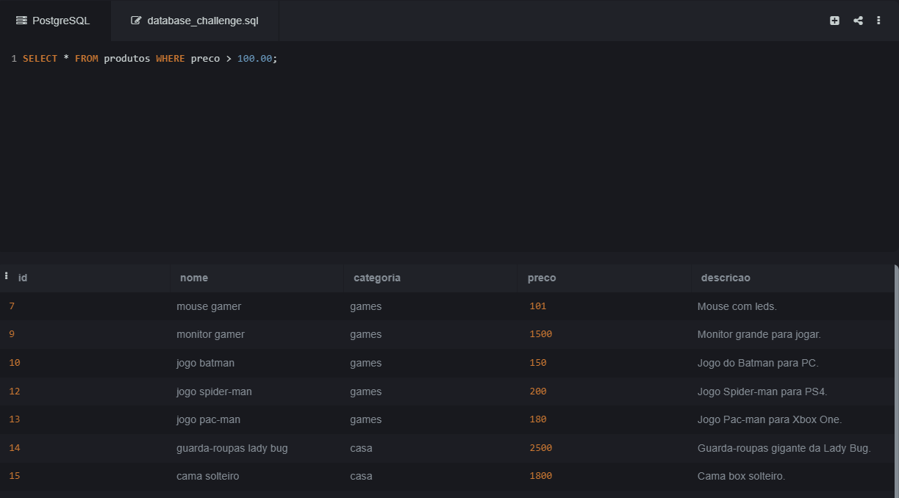


5. **Realizar uma consulta que apresente produtos com o preço entre "1000.00" e "2000.00":**

   ```sql
   SELECT * FROM produtos WHERE preco BETWEEN 1000.00 AND 2000.00;
   ```
   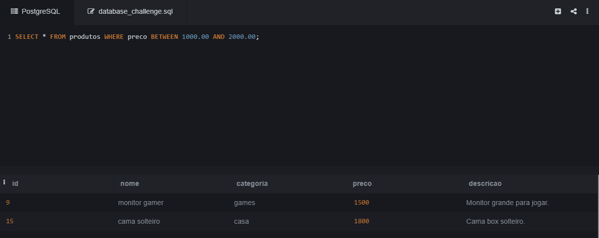

6. **Realizar uma consulta que apresente produtos em que o nome contenha a palavra "jogo":**

   ```sql
   SELECT * FROM produtos WHERE nome LIKE '%jogo%';
   ```
   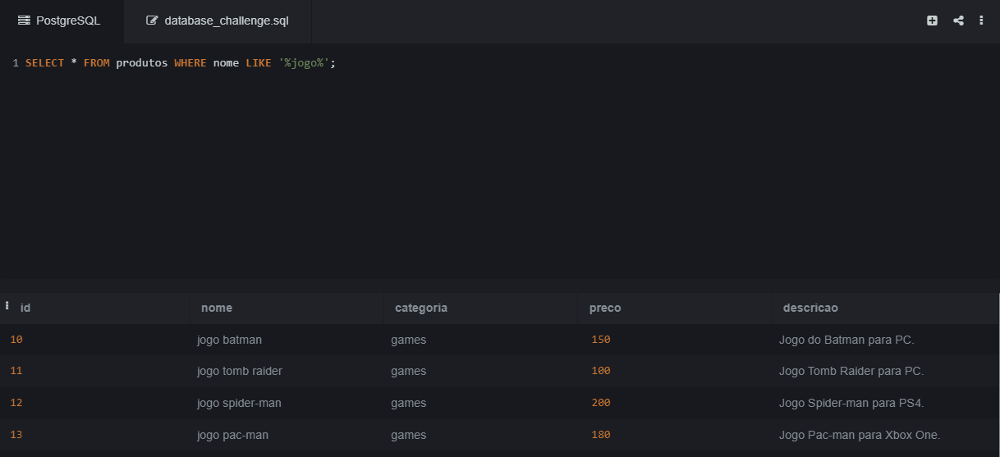

---

