# Resumo do Dia 8 

---
## NOSQL

### MongoDB

-   **Modelo de dados:** NoSQL, baseado em documentos no formato JSON (JavaScript Object Notation), similar a objetos em programação.
-   **Linguagem de consulta:** MQL (MongoDB Query Language), uma linguagem específica para MongoDB, com sintaxe similar a JavaScript.
-   **Recursos:** Flexibilidade de esquema, permitindo que documentos tenham estruturas diferentes. Escalabilidade horizontal, facilitando a distribuição de dados em vários servidores. Alta performance para leitura e escrita, ideal para aplicações com grande volume de dados.
-   **Ideal para:** Aplicações que exigem alta escalabilidade, flexibilidade de dados e processamento de grandes volumes de dados, como aplicações web e mobile, redes sociais e jogos online.

**Códigos básicos:**

JavaScript

```
// Adicionar um produto
db.produtos.insertOne({ nome: "Camiseta", descricao: "Camiseta de algodão", preco: 29.90 });

// Pesquisar um produto por nome
db.produtos.find({ nome: "Camiseta" });

// Pesquisar produtos com preço maior que 50
db.produtos.find({ preco: { $gt: 50 } });

// Remover um produto por nome
db.produtos.deleteOne({ nome: "Camiseta" });

```
#### Exercício Prático :: Exercitando NoSQL

Neste exercício prático, utilizamos o site [Humongous.io](https://www.humongous.io/app/playground/mongodb/new) como uma plataforma online para executar queries NoSQL em **MongoDB**. A seguir, um resumo das etapas de configuração e das consultas realizadas.

#### Configuração do Ambiente

1. Acesse o site [Humongous.io](https://www.humongous.io/app/playground/mongodb/new);
2. Cole as collections de dados fornecidas ([bson_usuarios.json](../Exercícios/NoSQL/bson_usuarios.txt) e [bson_produtos.json](../Exercícios/NoSQL/bson_produtos.txt)) no campo de dados;
3. Agora, o banco de dados está pronto para executar as queries na aba **Query**, clicando no botão **Run**.

---

### Queries a serem realizadas:

#### 1. Tabela de Usuários

Baseando-se na collection de **Usuários**, execute as seguintes queries:

1. **Realizar uma consulta que conte o número de registros existentes:**

   ```javascript
   db.usuarios.countDocuments({});
   ```
    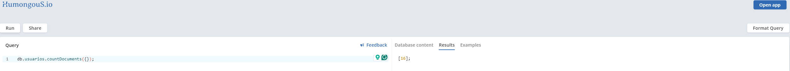

2. **Realizar uma consulta para alterar o usuário com o nome "Teste Start" para "Teste Finish":**

   ```javascript
   db.usuarios.updateOne({ nome: "Teste Start" }, { $set: { nome: "Teste Finish" } });
   ```
    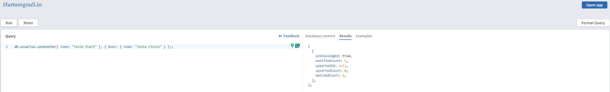

3. **Realizar uma consulta para encontrar o usuário com o nome "Bruce Wayne":**

   ```javascript
   db.usuarios.find({ nome: "Bruce Wayne" });
   ```
    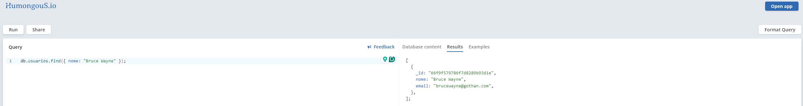

4. **Realizar uma consulta para encontrar o usuário com o e-mail "ghost_silva@fantasma.com":**

   ```javascript
   db.usuarios.find({ email: "ghost_silva@fantasma.com" });
   ```
    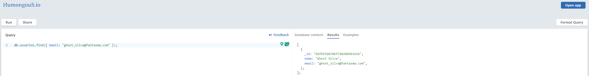

5. **Realizar uma consulta para deletar o usuário com e-mail "peterparker@marvel.com":**

   ```javascript
   db.usuarios.deleteOne({ email: "peterparker@marvel.com" });
   ```
    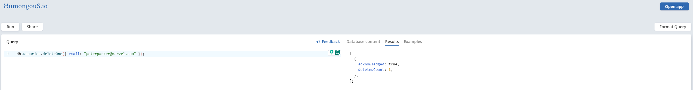

---

#### 2. Tabela de Produtos

Baseando-se na collection de **Produtos**, execute as seguintes queries:

1. **Realizar uma consulta que apresente produtos com descrição vazia:**

   ```javascript
   db.produtos.find({ descricao: "" });
   ```
    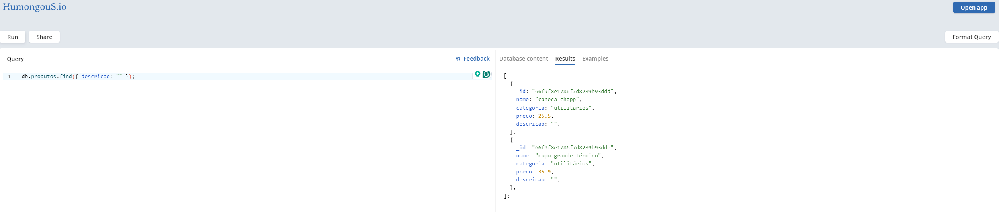

2. **Realizar uma consulta que apresente produtos com a categoria "games":**

   ```javascript
   db.produtos.find({ categoria: "games" });
   ```
   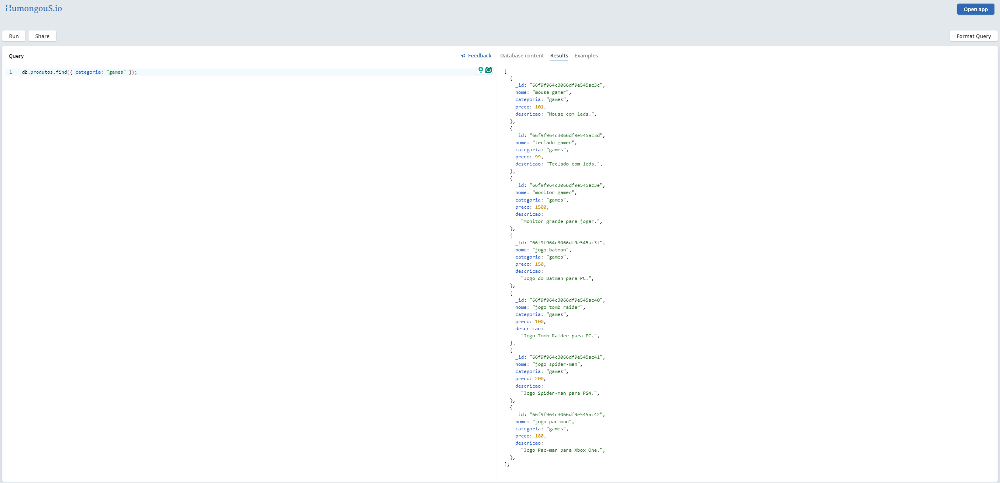

3. **Realizar uma consulta que apresente produtos com preço "0":**

   ```javascript
   db.produtos.find({ preco: 0 });
   ```
   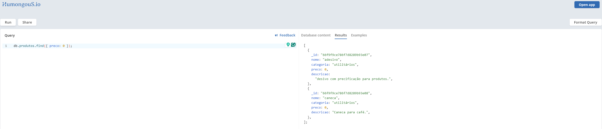

4. **Realizar uma consulta que apresente produtos com o preço maior que "100.00":**

   ```javascript
   db.produtos.find({ preco: { $gt: 100.00 } });
   ```
   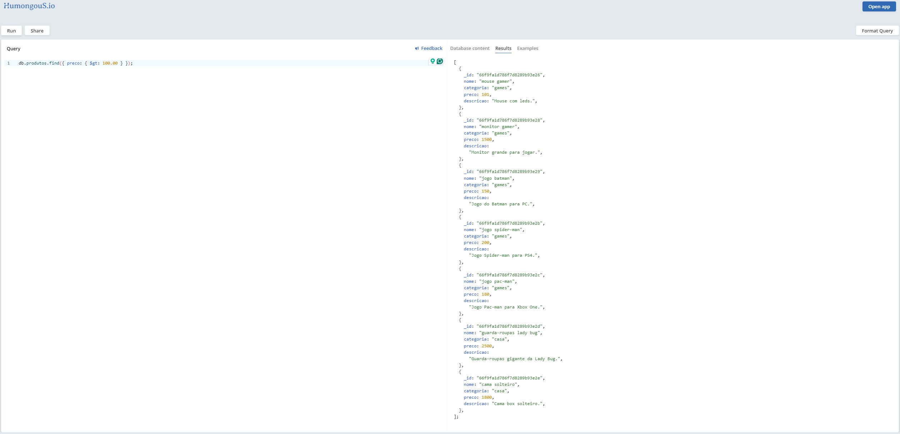

5. **Realizar uma consulta que apresente produtos com o preço entre "1000.00" e "2000.00":**

   ```javascript
   db.produtos.find({ preco: { $gte: 1000.00, $lte: 2000.00 } });
   ```
   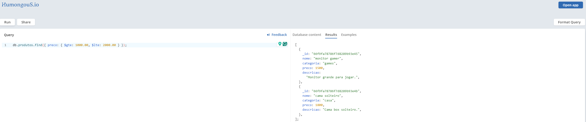

6. **Realizar uma consulta que apresente produtos em que o nome contenha a palavra "jogo":**

   ```javascript
   db.produtos.find({ nome: { $regex: "jogo", $options: "i" } });
   ```
   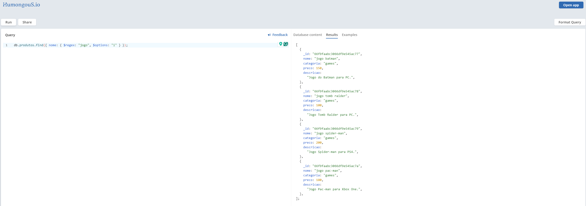

